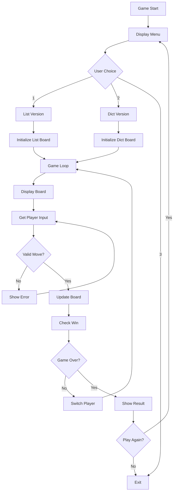

# Design Document

## Overview

This educational tic-tac-toe project demonstrates fundamental Python concepts through two parallel implementations using different data structures. The design prioritizes clarity, extensive documentation, and pedagogical value for week 3 Python learners who are just beginning to understand variables, loops, conditionals, and basic data structures.

The project will consist of two main game implementations:
1. **List-based version**: Uses nested lists to represent the game board
2. **Dictionary-based version**: Uses a dictionary with numeric keys (1-9) to represent the game board

Both implementations will produce identical gameplay and visual output, allowing students to compare different approaches to solving the same problem.

## Architecture

### High-Level Structure
```
projects/tictactoe/
├── .kiro/specs/tictactoe-demo/     # Specification files
├── docs/                           # Educational documentation
│   ├── README.md                   # Main project overview
│   ├── python-concepts.md          # Python concepts explained
│   ├── data-structures-guide.md    # Lists vs Dictionaries guide
│   └── diagrams/                   # Visual learning aids
├── tictactoe_lists.py             # Nested lists implementation
├── tictactoe_dict.py              # Dictionary implementation
└── main.py                        # Game launcher with menu
```

### Code Organization Principles
- **No functions or classes**: All code uses basic constructs only
- **Extensive commenting**: Every line explained for beginners
- **Parallel structure**: Both implementations follow identical logic flow
- **Educational focus**: Code optimized for learning, not performance

## Components and Interfaces

### 1. Game Board Representation

#### List-Based Implementation
```python
# board is a list containing 3 lists (rows)
# Each inner list contains 3 strings (columns)
board = [
    ['1', '2', '3'],  # Row 0: top row of the game board
    ['4', '5', '6'],  # Row 1: middle row of the game board  
    ['7', '8', '9']   # Row 2: bottom row of the game board
]
```

#### Dictionary-Based Implementation
```python
# board is a dictionary with number keys (1-9) and string values
# Keys represent board positions, values are either numbers or X/O
board = {
    1: '1', 2: '2', 3: '3',  # Top row positions
    4: '4', 5: '5', 6: '6',  # Middle row positions
    7: '7', 8: '8', 9: '9'   # Bottom row positions
}
```

### 2. Display System

Both implementations will use identical ASCII art output:
```
 1 | 2 | 3 
-----------
 4 | 5 | 6 
-----------
 7 | 8 | 9 
```

The display logic will differ in data access but produce the same visual result.

### 3. Game State Management

#### Core Variables (identical in both versions)
- `current_player`: String ('X' or 'O') - tracks whose turn it is
- `game_over`: Boolean - tracks if game has ended
- `winner`: String - stores winner ('X', 'O', or 'Tie')
- `moves_made`: Integer - counts total moves (for tie detection)

#### Input Validation Variables
- `valid_move`: Boolean - tracks if player input is valid
- `player_input`: String - stores raw user input
- `position`: Integer - stores converted position number

### 4. Win Detection Logic

#### List-Based Win Checking
Uses nested loops and index-based access:
- Row wins: `board[i][0] == board[i][1] == board[i][2]`
- Column wins: `board[0][j] == board[1][j] == board[2][j]`
- Diagonal wins: Direct index access to diagonal positions

#### Dictionary-Based Win Checking
Uses key-based access with predefined winning combinations:
- Winning patterns stored as lists of key combinations
- Check each pattern using dictionary key access

## Data Models

### Board State Transitions

#### Initial State
- List version: All positions show numbers 1-9
- Dict version: All keys map to their string number values

#### Move Processing
- List version: Convert position to row/col indices, update `board[row][col]`
- Dict version: Direct key access, update `board[position]`

#### Win State Detection
- Both versions check same logical patterns
- Different data access methods but identical win conditions

### Input/Output Flow



## Error Handling

### Input Validation Strategy
1. **Type Checking**: Ensure input can be converted to integer
2. **Range Checking**: Verify position is between 1-9
3. **Availability Checking**: Confirm position isn't already taken
4. **Clear Error Messages**: Explain what went wrong and how to fix it

### Error Message Examples
```python
# Invalid number format
"Please enter a number between 1 and 9"

# Position already taken  
"Position 5 is already taken by X. Choose an empty position."

# Out of range
"Position 12 is not valid. Please choose a number between 1 and 9"
```

### Graceful Degradation
- Invalid input doesn't crash the game
- Clear instructions provided after each error
- Game state remains consistent during error recovery

## Testing Strategy

### Manual Testing Approach
Since this is educational code without functions, testing will be manual and documented:

1. **Gameplay Testing**
   - Test all winning combinations (rows, columns, diagonals)
   - Test tie game scenarios
   - Test invalid input handling
   - Test game restart functionality

2. **Educational Testing**
   - Verify code comments are clear and accurate
   - Test that beginners can follow the logic
   - Ensure both versions produce identical output

3. **Cross-Implementation Testing**
   - Compare list vs dictionary versions side-by-side
   - Verify identical gameplay experience
   - Test that learning objectives are met

### Documentation Testing
- README clarity for target audience
- Code comment accuracy and helpfulness
- Diagram correctness and educational value
- Exercise suggestions are appropriate for skill level

## Educational Design Decisions

### Comment Strategy
- **Line-by-line comments**: Explain what each line does
- **Concept explanations**: Why we use certain approaches
- **Comparison notes**: Highlight differences between implementations
- **Learning callouts**: Point out key Python concepts being demonstrated

### Code Style for Beginners
- **Verbose variable names**: `current_player` instead of `cp`
- **Explicit operations**: Break complex operations into steps
- **Consistent patterns**: Same logic flow in both implementations
- **Visual separation**: Clear sections with comment headers

### Progressive Complexity
- Start with simple variable assignments
- Introduce loops gradually
- Build up to nested structures
- End with complete game logic integration

This design ensures that week 3 Python learners can understand every aspect of the code while seeing practical applications of fundamental concepts they're learning.