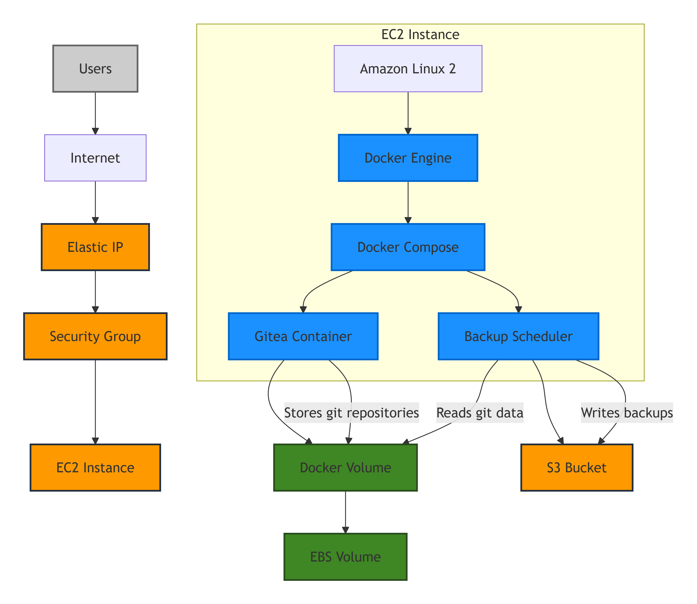
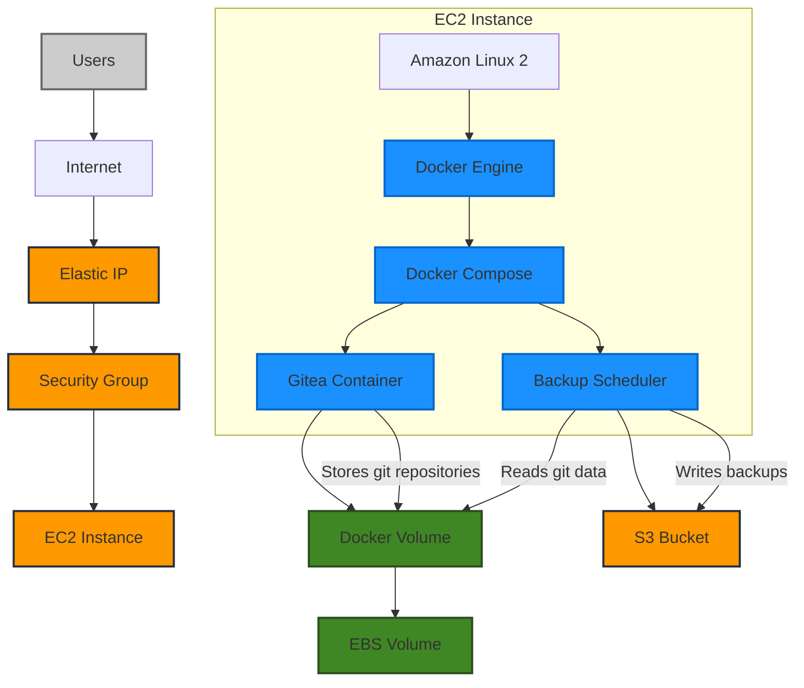

# Gitea Git Server Component Diagram

## System Architecture Components

## Component Descriptions

### User-Facing Components

- **Users**: Instructors and students accessing the git server
- **Internet**: Public internet access
- **Elastic IP**: Static IP address for consistent access
- **Security Group**: Firewall rules allowing HTTPS (443) and SSH (22) access

### Compute Components

- **EC2 Instance**: t3.small running Amazon Linux 2
- **Docker Engine**: Container runtime environment
- **Docker Compose**: Container orchestration tool
- **Gitea Container**: Containerized Gitea application

### Storage Components

- **Docker Volume**: Mapped location for persistent data
- **EBS Volume**: Persistent block storage (20GB gp3)
- **S3 Bucket**: Storage for repository backups

### Management Components

- **Backup Scheduler**: Cron jobs for automated backups

## Key Interfaces and Data Flows

1. **User Access Flow**:
   - Users connect to the Gitea web UI or git CLI via HTTPS
   - Traffic routes through the internet to the Elastic IP
   - Security Group filters traffic, allowing only HTTPS and SSH
   - Traffic reaches the Gitea container running on Docker

2. **Data Storage Flow**:
   - Gitea container stores all repository data on Docker volume
   - Docker volume is mapped to EBS volume for persistence
   - Data persists across container restarts and EC2 reboots

3. **Backup Flow**:
   - Backup scheduler runs on scheduled intervals
   - Reads repository data from Docker volume
   - Compresses and encrypts data
   - Transfers backup archive to S3 bucket

4. **Management Flow**:
   - Administrator connects via SSH to EC2 instance
   - Manages system through Docker Compose commands
   - Updates and configuration changes applied through Docker

This architecture provides a simple, maintainable git server solution with appropriate data persistence and backup mechanisms to meet the requirements for teaching coding on AWS.
