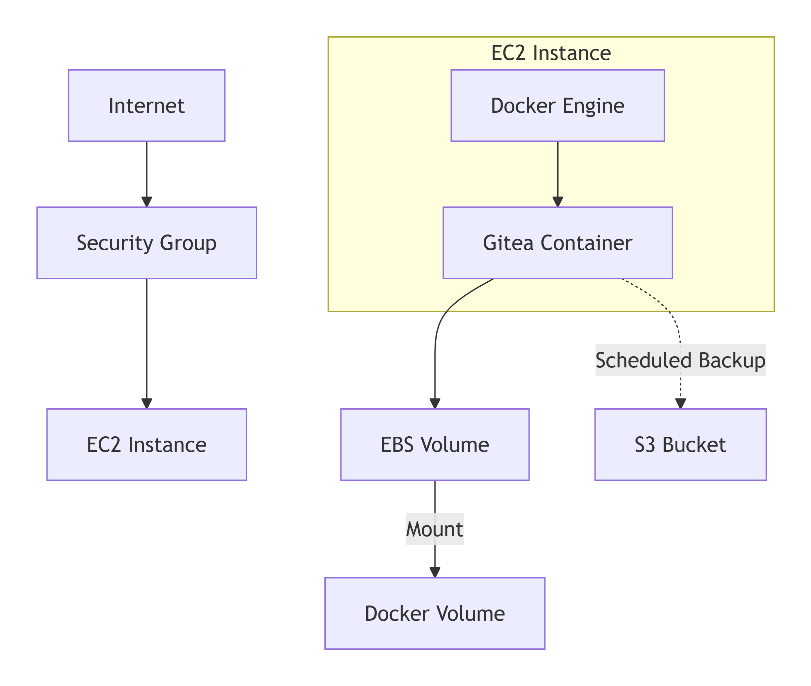
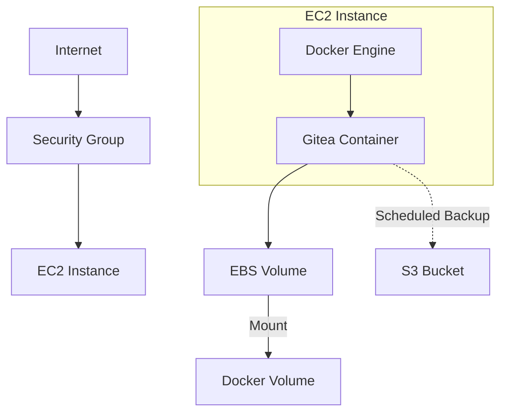

# High-Level Design: Gitea Git Server for Isengard

## 1. Executive Summary

This document outlines the high-level design for deploying a lightweight, easy-to-maintain Gitea git server in an Isengard account. The solution will utilize Docker containers on EC2, with persistent storage on EBS volumes and automated backups to S3. The implementation prioritizes simplicity, security, and minimal maintenance overhead while meeting the core requirement of providing a reliable git server for teaching AWS development concepts.

The design centers around a containerized Gitea deployment with appropriate security controls, networking configuration, and data persistence strategies that align with the requirements for a small-scale (1-5 users, ~10 repositories) teaching environment. This approach balances ease of deployment, operational simplicity, and sufficient functionality for educational demonstrations.

## 2. Strategic Context

### 2.1 Current Limitations

Currently, there is no dedicated git server for teaching coding on AWS in the Isengard environment. This creates challenges for demonstrating code version control, collaboration, and repository management during educational sessions. Instructors need a reliable, accessible platform to host example code and show git workflows.

### 2.2 Business Drivers

- **Educational Effectiveness**: A dedicated git server will enhance teaching capabilities by providing a controlled environment to demonstrate source code management principles.
- **Simplified Workflow**: Having a self-managed git server eliminates dependencies on external services and possible connectivity issues during demonstrations.
- **Customization**: Full control over the git server allows for tailoring the environment specifically for teaching purposes.

## 3. Technical Architecture

### 3.1 Architecture Overview

The Gitea git server will be implemented using a simple yet robust architecture:

1. **Compute Layer**: Amazon EC2 instance running Docker
2. **Application Layer**: Gitea container running on Docker
3. **Data Layer**: 
   - EBS volume for repository storage
   - S3 bucket for automated backups
4. **Network Layer**: 
   - Public subnet with security group controls
   - Elastic IP for consistent access

### 3.2 Component Details

#### 3.2.1 EC2 Instance

- **Instance Type**: t3.small (2 vCPUs, 2GB RAM) - sufficient for the required scale
- **AMI**: Amazon Linux 2
- **Region**: us-west-2
- **Security Hardening**: Minimal installed packages, security groups limiting access

#### 3.2.2 Docker Environment

- **Docker Engine**: Latest stable version
- **Container Management**: Docker Compose for simplified deployment and updates
- **Container Configuration**: Environment variables for Gitea configuration

#### 3.2.3 Gitea Application

- **Version**: Latest stable Gitea release
- **Configuration**: 
  - Local user authentication
  - HTTPS configuration with Let's Encrypt
  - Database: SQLite (embedded, sufficient for small scale)
  - Customized for teaching environment

#### 3.2.4 Storage Components

- **EBS Volume**: 
  - Size: 20GB (expandable as needed)
  - Type: gp3 (balanced performance)
  - Mounted at /var/lib/docker/volumes/gitea
  
- **S3 Backup Bucket**:
  - Standard storage class
  - Lifecycle rules to manage backup retention
  - Server-side encryption enabled

#### 3.2.5 Networking

- **Elastic IP**: For consistent access endpoint
- **Security Group**: 
  - Allow HTTPS (443) from anywhere
  - Allow SSH (22) from administrative IPs only
- **DNS**: AWS-provided URL with Route 53 if needed

### 3.3 Scalability Considerations

While the immediate requirements specify a small user base (1-5 users) and limited repositories (~10), the design allows for reasonable scaling:

- EC2 instance can be resized if necessary
- EBS volume can be expanded
- Gitea can handle increased repository count within the constraints of the host resources

For significant scaling beyond requirements, a more distributed architecture would be recommended in the future.

## 4. Implementation Strategy

### 4.1 Deployment Approach

The deployment will follow a straightforward approach:

1. **Infrastructure Provisioning**:
   - Create EC2 instance with attached EBS volume
   - Configure security groups and networking
   - Assign Elastic IP

2. **Software Installation**:
   - Install Docker and Docker Compose
   - Create necessary directory structure
   - Configure automatic startup

3. **Gitea Deployment**:
   - Create Docker Compose configuration
   - Initialize Gitea container
   - Configure persistent storage mappings

4. **Security Configuration**:
   - Set up HTTPS with Let's Encrypt
   - Configure firewall rules
   - Implement initial admin account

5. **Backup System Setup**:
   - Create S3 bucket
   - Configure backup scripts
   - Set up scheduled backup jobs

### 4.2 Configuration Management

Configuration will be managed through:

- Docker Compose files for container configuration
- Environment variables for application settings
- Configuration files stored on the EBS volume
- Resource definitions documented for consistency

### 4.3 Testing Strategy

The deployment will be validated through:

1. **Functional Testing**:
   - Verify git operations (clone, push, pull)
   - Test user creation and authentication
   - Validate repository management functions

2. **Security Testing**:
   - Verify HTTPS implementation
   - Validate access controls
   - Check for exposed services

3. **Backup Testing**:
   - Verify backup creation
   - Test restoration procedures

## 5. Operational Considerations

### 5.1 Monitoring and Logging

- **System Monitoring**: Basic CloudWatch metrics for instance health
- **Application Logs**: Docker logs forwarded to CloudWatch Logs
- **Access Logs**: HTTPS and application access logs retained

### 5.2 Backup and Recovery

- **Automated Backups**: Daily repository backups to S3
- **Backup Retention**: 30-day retention policy
- **Recovery Process**: Documented procedure for restoring from backups

### 5.3 Maintenance Procedures

- **Updates**: Scheduled Docker image updates during maintenance windows
- **Security Patches**: Automated security updates for the host OS
- **Health Checks**: Regular validation of system functionality

## 6. Alternatives Analysis

### 6.1 Alternative Solutions Considered

#### 6.1.1 GitLab CE

- **Pros**: More feature-rich, integrated CI/CD
- **Cons**: Higher resource requirements, more complex maintenance, depricated
- **Decision**: Rejected as too heavyweight for current needs

#### 6.1.2 Direct Installation (non-containerized)

- **Pros**: Potentially simpler initial setup
- **Cons**: More difficult to update, less isolated, harder to back up
- **Decision**: Rejected in favor of containerized approach for maintainability

#### 6.1.3 AWS CodeCommit

- **Pros**: Managed service, minimal maintenance
- **Cons**: Less control, different user experience, IAM complexity
- **Decision**: Rejected due to preference for self-contained teaching environment

### 6.2 Decision Rationale

Gitea in Docker on EC2 was selected because:

1. **Resource Efficiency**: Gitea has low resource requirements ideal for teaching demonstrations
2. **Simplicity**: Straightforward deployment and management
3. **Containerization**: Allows for easy updates and consistent environment
4. **Self-Contained**: Provides complete control over the git server environment

## 7. Success Metrics

### 7.1 Implementation Metrics

- Successful deployment completion within timeline
- All required functionality operational
- Security requirements satisfied
- Backup system operational

### 7.2 Operational Metrics

- System uptime during teaching sessions (target: 99.9% during scheduled classes)
- Backup success rate (target: 100%)
- Mean time to recovery for any issues (target: <1 hour)
- User satisfaction with git server functionality (qualitative feedback)

## 8. Implementation Roadmap

### 8.1 Phase 1: Infrastructure Setup

- Provision EC2 instance
- Configure networking and security
- Set up EBS volume

### 8.2 Phase 2: Application Deployment

- Install Docker and dependencies
- Deploy Gitea container
- Configure persistent storage

### 8.3 Phase 3: Configuration and Security

- Configure HTTPS
- Set up user authentication
- Implement security controls

### 8.4 Phase 4: Backup and Maintenance

- Create S3 bucket and backup scripts
- Configure automated backups
- Document maintenance procedures

### 8.5 Phase 5: Testing and Validation

- Perform comprehensive testing
- Document user guides
- Finalize operational runbook
