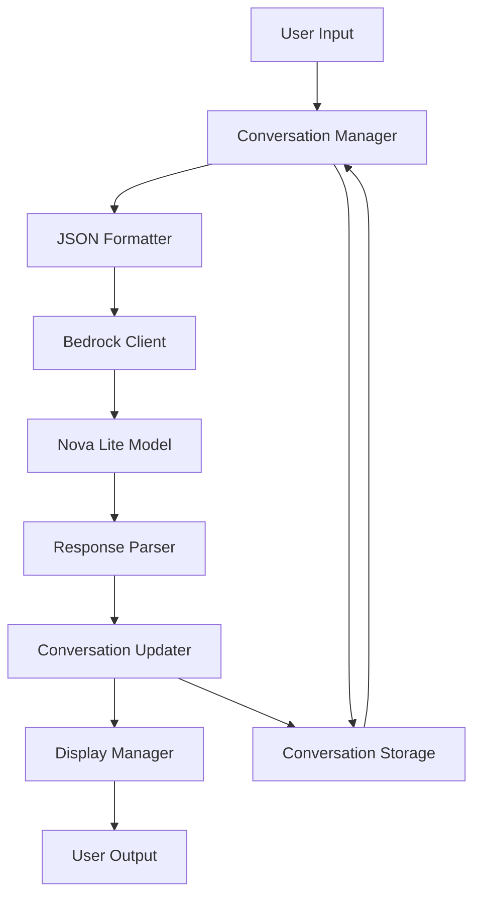

# Design Document

## Overview

The Educational Chatbot is a Python-based demonstration application that teaches programming students how conversation state management works with Large Language Models. The application uses Amazon Bedrock's Nova Lite model to showcase that LLMs are stateless reasoning engines, while all memory and conversation management is handled by the application layer.

The design emphasizes educational clarity through visible JSON data structures, step-by-step debugging capabilities, and clear separation between application logic and LLM interactions.

## Architecture

The application follows a simple, linear architecture optimized for educational understanding:



### Key Design Principles

1. **Educational Transparency**: Every data transformation is visible and logged
2. **Stateless LLM Interaction**: Each API call includes full conversation history
3. **JSON-First Approach**: All data structures are JSON-serializable for visibility
4. **Debugger-Friendly**: Strategic breakpoints and variable inspection points
5. **Minimal Dependencies**: Only essential libraries to reduce complexity

## Components and Interfaces

### 1. Conversation Management Functions

**Purpose**: Simple functions that manage the conversation flow and state

**Key Functions**:
- `create_new_conversation()`: Returns empty conversation dictionary
- `add_message_to_conversation(conversation, role, message)`: Adds message to conversation list
- `conversation_to_json(conversation)`: Returns formatted JSON string of conversation
- `process_conversation_turn(conversation, user_input)`: Handles complete conversation turn

**Data Structure**:
```json
{
    "conversation_id": "uuid-string",
    "created_at": "ISO-timestamp",
    "messages": [
        {
            "role": "user|assistant",
            "content": "message text",
            "timestamp": "ISO-timestamp"
        }
    ],
    "metadata": {
        "model": "amazon.nova-lite-v1:0",
        "total_messages": 0
    }
}
```

### 2. Bedrock API Functions

**Purpose**: Simple functions that handle AWS Bedrock API interactions with educational logging

**Key Functions**:
- `create_bedrock_client()`: Returns configured boto3 Bedrock runtime client with 60-minute timeout
- `prepare_bedrock_request(conversation)`: Formats conversation dictionary for Nova Lite API format
- `send_to_bedrock(client, request_data)`: Makes API call to amazon.nova-lite-v1:0 and logs request/response
- `extract_response_content(bedrock_response)`: Gets message text from Nova Lite response format

**Configuration**:
- Model ID: `amazon.nova-lite-v1:0`
- Timeout: 60 minutes (3600 seconds) for both connect and read
- Region: Configurable (default us-east-1)

**Nova Lite API Format**:
```json
{
    "messages": [
        {
            "role": "user",
            "content": [
                {"text": "user message text"}
            ]
        },
        {
            "role": "assistant", 
            "content": [
                {"text": "assistant response text"}
            ]
        }
    ],
    "inferenceConfig": {
        "maxTokens": 1000,
        "temperature": 0.7,
        "topP": 0.9
    }
}
```

### 3. Educational Display Functions

**Purpose**: Simple functions that provide formatted output for learning purposes

**Key Functions**:
- `print_conversation_state(conversation)`: Pretty-prints JSON conversation dictionary
- `print_api_request(request_data)`: Displays outgoing API request
- `print_api_response(response)`: Displays incoming API response
- `print_state_change(before_conversation, after_conversation)`: Shows conversation changes

### 4. Debug Helper Functions

**Purpose**: Simple functions that provide debugging utilities for students

**Key Functions**:
- `debug_pause(message)`: Pauses execution with educational message
- `debug_inspect_variable(var_name, value)`: Prints formatted variable inspection
- `debug_trace_step(step_name)`: Logs execution flow for students

## Data Models

### Conversation Dictionary Structure

The core data structure uses simple Python dictionaries that demonstrate application-managed state:

```python
# Example conversation dictionary
conversation = {
    "conversation_id": "uuid-string",
    "created_at": "2024-01-01T10:00:00Z",
    "messages": [
        {
            "role": "user",
            "content": "Hello!",
            "timestamp": "2024-01-01T10:00:00Z"
        },
        {
            "role": "assistant", 
            "content": "Hi there! How can I help you?",
            "timestamp": "2024-01-01T10:00:01Z"
        }
    ],
    "metadata": {
        "model": "amazon.nova-lite-v1:0",
        "total_messages": 2
    }
}
```

### API Request/Response Dictionary Structures

```python
# Bedrock API request format for Nova Lite
bedrock_request = {
    "messages": [
        {
            "role": "user",
            "content": [{"text": "user message"}]
        }
    ],
    "inferenceConfig": {
        "maxTokens": 1000,
        "temperature": 0.7,
        "topP": 0.9
    }
}

# Bedrock API response format from Nova Lite
bedrock_response = {
    "output": {
        "message": {
            "role": "assistant",
            "content": [{"text": "assistant response"}]
        }
    },
    "usage": {
        "inputTokens": 10,
        "outputTokens": 15,
        "totalTokens": 25
    }
}
```

## Error Handling

### AWS Authentication Errors
- Clear messages about credential configuration
- Links to AWS CLI setup documentation
- Fallback to environment variable instructions

### API Rate Limiting
- Exponential backoff with educational logging
- Clear explanation of why delays occur
- Visible retry attempts for learning

### Model Access Errors
- Specific messaging about Nova Lite availability
- Instructions for requesting model access
- Graceful degradation with mock responses for testing

### JSON Parsing Errors
- Detailed error messages showing malformed JSON
- Step-by-step parsing demonstration
- Recovery strategies with valid examples

## Testing Strategy

### Unit Tests
- `test_conversation_manager.py`: Conversation state management
- `test_bedrock_client.py`: API interaction (with mocking)
- `test_educational_display.py`: Output formatting
- `test_data_models.py`: JSON serialization/deserialization

### Integration Tests
- `test_full_conversation_flow.py`: End-to-end conversation simulation
- `test_error_scenarios.py`: Error handling and recovery
- `test_debugging_features.py`: Debug helper functionality

### Educational Tests
- `test_json_visibility.py`: Ensures all JSON operations are logged
- `test_state_transitions.py`: Verifies conversation state changes are visible
- `test_llm_statelessness.py`: Confirms each API call includes full history

### Mock Strategy
- Mock Bedrock responses for consistent testing
- Provide sample conversation flows
- Enable offline development and testing

## Implementation Considerations

### Educational Features
1. **Verbose Logging**: Every operation logged with clear descriptions
2. **JSON Pretty Printing**: All JSON output formatted for readability
3. **Step-by-Step Execution**: Clear markers for debugging sessions
4. **State Visualization**: Before/after comparisons for data changes

### Nova Lite Specific Considerations
- **Timeout Configuration**: 60-minute timeout required for boto3 client
- **Message Format**: Content must be wrapped in list with text objects
- **Model Identifier**: Use exact string `amazon.nova-lite-v1:0`
- **Response Parsing**: Extract text from nested content structure

### Performance Considerations
- Conversation history truncation for long sessions (Nova Lite max 5K tokens)
- Efficient JSON serialization
- Minimal memory footprint for educational environments
- Handle potential 60-minute response times gracefully

### Security Considerations
- AWS credential best practices documentation
- No hardcoded secrets in educational code
- Clear separation of configuration from code
- Student environment credential management

### Deployment Considerations
- Simple pip requirements.txt (boto3, botocore)
- Clear setup instructions for student environments
- Environment variable configuration guide
- Compatibility with common Python debugging tools (pdb, IDE debuggers)
- AWS region configuration for student accounts